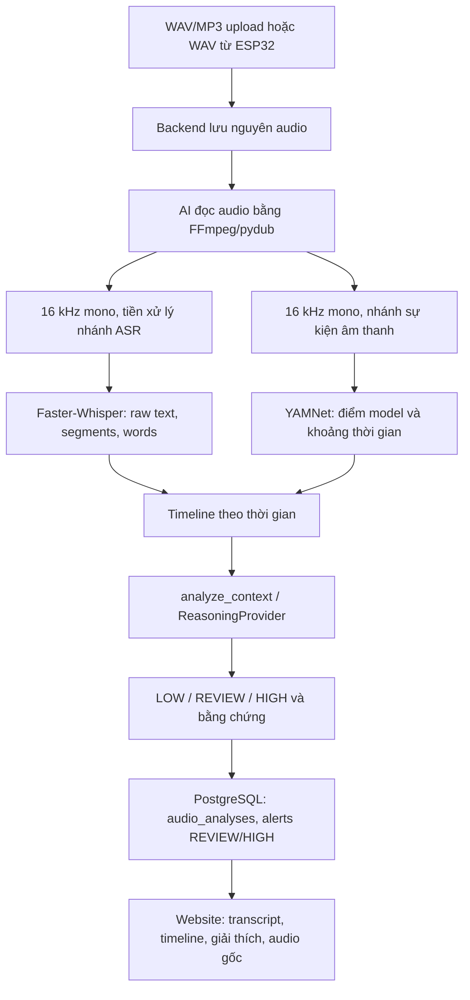

# Báo cáo pipeline audio và kiểm thử — 08/10/2026

Website chạy trực tiếp trên Windows tại http://localhost:3000/dang-nhap.html.
ASR hiện tại: **Faster-Whisper large-v3, local, CUDA trên RTX 3060 12 GB**.
YAMNet chạy CPU. Bản Docker đã cập nhật cấu hình nhưng **chưa build/chạy được**:
Docker Desktop trả `Docker Desktop is unable to start`. Không khởi động lại PC.

## 1. Pipeline đã đọc và xác định

Đã đọc Compose, Dockerfile/requirements AI, server/transcription, Program.cs,
AlertsController/AlertsService/ApplicationEntities, JS cảnh báo/lịch sử và hai
luồng firmware ESP32 gửi multipart WAV hoặc raw WAV. Receiver WebSocket nhận
PCM, lưu WAV rồi gọi backend `analyze-existing`.

Pipeline trước đây có nhãn YAMNet, ASR, chỉnh lời theo regex, điểm nguy cơ cộng
thủ công, speaker đổi theo khoảng lặng và kiểm duyệt có thể ghi đè audio.
Pipeline hiện tại dùng chung một hàm phân tích cho mọi waveform:



Không viết lại các trang quản lý, đăng nhập hoặc toàn bộ project. Tầng quyết định
cũ trong server/AlertsService được thay bằng pipeline tập trung; schema cũ được giữ.

## 2. File sửa và chức năng

| File | Thay đổi |
|---|---|
| `ai-training/transcription.py` | ASR local/cloud/hybrid; raw/normalized text, timestamp thật; bỏ các correction đổi nghĩa; nhận diện kết quả ASR nghi ngờ; không ép giải mã khi VAD không thấy speech và YAMNet không hỗ trợ speech. |
| `ai-training/asr_runtime.py` | Model cấu hình bằng biến môi trường; CUDA/CPU; fallback cả lỗi khởi tạo và lỗi giải mã lazy; không tự hạ model xuống small. |
| `ai-training/audio_events.py` | Ánh xạ theo tên CSV thật; sửa nhầm Basketball bounce/Slam; giữ native scores; timestamp frame; tách speech_activity với câu ASR; tín hiệu hét yếu riêng. |
| `ai-training/context_analysis.py` | Một tầng rules xét câu, bằng chứng gần nhau, phủ định/ngữ cảnh sinh hoạt, ngữ cảnh phim/vui; interface ReasoningProvider, registry mở rộng. |
| `ai-training/analysis_pipeline.py` | Ghép timeline; output schema 2.0; SHA-256 original; bản kiểm duyệt tùy chọn lưu riêng trong processed; Segment labels, không giả speaker. |
| `ai-training/server.py` | Ba route dùng chung pipeline; health thật, log GPU/model/YAMNet; nạp DLL Windows; chặn đường dẫn thoát upload root; lỗi giải mã có phản hồi. |
| `ai-training/Dockerfile` | Copy các module mới, default local/medium/rules; build CUDA qua INSTALL_CUDA_LIBS, một worker model. |
| `ai-training/requirements.txt` | Faster-Whisper tương thích model turbo; giữ TensorFlow/YAMNet/Groq. |
| `ai-training/requirements-windows.txt` | Waitress và thư viện CUDA/cuDNN cho Windows. |
| `ai-training/tests/test_transcription_contract.py` | Raw/timestamp, correction an toàn, routing local/hybrid, không tạo model score/timestamp giả, VAD/no-speech. |
| `ai-training/tests/test_context.py` | Normal/false positive, đồng xuất hiện, khoảng cách thời gian, tentative signals, CSV đúng, timeline. |
| `ai-training/tests/test_pipeline_integrity.py` | GPU fallback, lỗi lazy decoder, original không đổi khi có censor. |
| `backend-csharp/Models/ApplicationEntities.cs` | Alert.RiskLevel và entity AudioAnalysis. |
| `backend-csharp/Data/ApplicationDbContext.cs` | DbSet cho mọi lần phân tích, gồm LOW. |
| `backend-csharp/audio-analysis-schema.sql` | Thêm cột/bảng/index theo kiểu idempotent, không xóa dữ liệu. |
| `backend-csharp/SchoolGuardian.Api.csproj` | Đưa SQL upgrade vào output/publish. |
| `backend-csharp/Program.cs` | Áp dụng schema bổ sung; dùng upload directory cấu hình; tiếp tục phục vụ frontend. |
| `backend-csharp/Services/AlertsService.cs` | Lưu nguyên JSON kết quả, ASR và timeline; chỉ tạo alert REVIEW/HIGH; confidence_score mới trả null; API xem lại mọi analysis; Edge chỉ là metadata. |
| `backend-csharp/Controllers/AlertsController.cs` | Mọi raw WAV qua AI; giữ original bằng CreateNew; không overwrite event ID với bytes khác; chống job trùng trong một process; limit upload 50 MB; route analyses. |
| `backend-csharp/Services/StatisticsService.cs` | Urgent dùng risk HIGH với bản mới; tương thích bản cũ. |
| `backend-csharp/Services/ParentService.cs` | Trả risk_level; không đưa số 0 lưu tương thích thành confidence AI. |
| `frontend/dung-chung.js` | Renderer chung an toàn: transcript, raw audit, sự kiện, timeline, risk/evidence/limitations/audio gốc; timestamp phần giây; bỏ helper confidence cũ. |
| `frontend/canh-bao.js`, `frontend/canh-bao.html` | Upload mở report ngay cả LOW; chi tiết alert dùng report mới; loading không hứa thời gian giả. |
| `frontend/lich-su.js`, `frontend/lich-su.html` | Chi tiết có report, CSV dùng nguy cơ; thêm lịch sử mọi audio và mở lại transcript của LOW. |
| `frontend/tong-quan.js` | Bỏ phần trăm confidence, hiển thị risk. |
| `frontend/giao-dien.css`, `frontend/vendor/` | Giữ font/Chart.js/SignalR/bootstrap-icons cục bộ từ bản chạy Windows, tránh phụ thuộc CDN khi mở website. |
| Các HTML trong `frontend/` | Đổi phiên bản cache dung-chung.js thành v8; giữ giao diện hiện có. |
| `docker-compose.yml`, `docker-compose.gpu.yml`, `.env.example` | ASR/reasoning/model cấu hình được, CUDA libs + GPU reservation ở override, original shared volume. |
| `scripts/Docker-Common.ps1`, `scripts/Start-SafeVoice.ps1` | Default medium/local/rules; GPU build không cần image CPU làm base. |
| `scripts/Windows-Common.ps1`, `scripts/Restart-AI.ps1` | Cấu hình native model/device/mode; nạp lại riêng AI, không reboot PC. |
| `scripts/validate_audio.py` | Tạo giọng đọc tiếng Việt tổng hợp có manifest, kiểm thử WAV/MP3 qua API, SHA-256/timestamps/risk. |
| `scripts/validate_environmental_audio.py` | ESC-50 và bản ghép dàn dựng help + glass + cry. |
| `scripts/validate_other_sounds.py` | SFX scream công khai; bản ghép strong/weak scream + impact và joy + scream; giữ attribution. |
| `scripts/validate_music.py` | Hai mẫu nhạc không lời công khai từ catalogue librosa; lưu attribution, kiểm tra không tự HIGH. |
| `scripts/compare_whisper.py`, `scripts/validate_cpu.py` | Thử 3 model GPU và giải mã CPU thực tế. |
| `scripts/validate_website.py`, `scripts/validate_device_api.py` | Chrome thật và luồng HTTP thiết bị/idempotence/bảo toàn file/phân quyền. |
| `.gitignore`, `WINDOWS.md`, `DOCKER.md`, `AI_PIPELINE.md` | Giữ tests trong source, loại cache/data bí mật khỏi Git, cập nhật hướng dẫn và giới hạn. |

Firmware đã được kiểm tra luồng audio; **không nạp firmware lên thiết bị** và chưa
kiểm thử microphone ESP32 vật lý. Không sửa cơ chế Edge bằng suy đoán.

## 3. Speech-to-Text và cấu hình

Máy hiện tại dùng `large-v3` vì trong nhóm mẫu tổng hợp đã thử nó chép rõ các câu
quan trọng hơn medium. Đây là quan sát trên nhóm nhỏ, không là kết luận benchmark.
Cả medium, large-v3 và large-v3-turbo đã chạy CUDA trên 5 reference mỗi model.
Default trong image mới là medium; **không hard-code small**.

```dotenv
ASR_MODE=local
WHISPER_MODEL_SIZE=large-v3
WHISPER_DEVICE=auto
REASONING_MODE=rules
CREATE_CENSORED_AUDIO=false
```

Cloud dùng Groq khi có GROQ_API_KEY. Hybrid chạy local trước, chỉ thử cloud khi
local lỗi hoặc chất lượng cần xem lại, và chỉ khi có key. Local không gọi cloud
ngay cả khi key tồn tại. Routing đã test bằng mock; chưa gọi Groq thực tế vì
không có key cấu hình. Core local không cần API trả phí.

`raw_transcript` giữ nguyên ASR. `normalized_transcript` chỉ NFC/khoảng trắng;
không đổi anh mày/chơi nhau thành đánh mày/đánh nhau. Segment không chắc chắn
được giữ để audit, đánh dấu accepted=false, không đưa vào bằng chứng quyết định.
Không tạo timestamp 0 giả khi provider thiếu timestamp. Không suy diễn speaker.

## 4. GPU và runtime

Log đã xác nhận và đã giải mã audio trên thiết bị này:

```text
[AI] GPU available: YES
[ASR] device: cuda
[ASR] model: large-v3
[YAMNet] loaded: YES
```

GPU initialization/inference lỗi sẽ thử CPU với cùng model. Lỗi tải cả model
được phản ánh unavailable/REVIEW, không hạ kết quả thành an toàn. CPU medium đã
thử giải mã thật câu “Đừng đánh tao! Cứu với!”. YAMNet chạy CPU để dành VRAM cho ASR.

## 5. API output mới

AI `POST http://127.0.0.1:5000/analyze-full`, JSON input:

```json
{"filepath":"ten-file-da-luu-trong-upload-root.wav"}
```

Upload browser đi qua `POST /api/alerts/upload`, multipart field `audio`, JWT hoặc
device token hợp lệ. Backend trả `result` nguyên bản cùng analysis_id và alerts.
`GET /api/alerts/analyses` và `/api/alerts/analyses/{id}` yêu cầu đăng nhập và giới
hạn phụ huynh theo lớp. WAV/MP3 được hỗ trợ; input giới hạn 50 MB.

Ví dụ rút gọn từ **audio ghép dàn dựng đã chạy thật**, không phải sự cố thực:

```json
{
  "status": "success",
  "audio": {"duration_seconds": 10.216},
  "asr": {
    "provider": "faster-whisper", "model": "large-v3", "device": "cuda",
    "has_speech": true,
    "raw_transcript": " Đừng đánh tao. Cứu với.",
    "normalized_transcript": "Đừng đánh tao. Cứu với.",
    "segments": [
      {"start": 0.0, "end": 0.84, "text": "Đừng đánh tao."},
      {"start": 1.74, "end": 2.18, "text": "Cứu với."}
    ]
  },
  "sound_events": {"scream": 0.392698, "cry": 0.97886, "impact": 0.951248, "speech": 0.99822},
  "analysis": {
    "school_violence_detected": true, "risk_level": "high",
    "category": "possible_physical_violence",
    "needs_human_review": true,
    "evidence": ["Lời yêu cầu dừng đánh và kêu cứu", "Va đập 3.8–5.3s", "Khóc sau va đập"]
  },
  "model_versions": {"asr": "large-v3", "audio_events": "yamnet/1", "reasoning": "rules"}
}
```

Output đầy đủ còn có timeline được sort, words/model metrics thật, evidence_items,
audio SHA-256, warnings/quality/limitations, audio_events với native event intervals.
YAMNet `speech_activity` không giả thành câu speech không có text.
Mẫu JSON đầy đủ: `.runtime/validation/api-output-example.json`.

Original nằm trong `backend-csharp/uploads` hoặc Docker audio_data. Nếu bật censor,
bản mới nằm trong `processed/*_censored.wav`. Original không bị overwrite; website
phát original. Kiểm thử so SHA-256 trước/sau và bytes tải lại đã đạt.

## 6. AI đánh giá nguy cơ như thế nào

Hiện dùng RulesReasoningProvider, một tầng quyết định rõ ràng. Không có reasoning
LLM đang âm thầm chạy. Interface/registry cho local/cloud/hybrid đã có; provider
chưa đăng ký sẽ dùng rules và ghi limitation. Không hard-code OpenAI trong core.

- LOW: chưa đủ bằng chứng; đánh răng/cầu/giá hoặc chửi thề đơn lẻ không tạo HIGH.
- REVIEW: lời kêu cứu/đe dọa đơn lẻ, scream/cry đơn lẻ, tranh cãi lớn hoặc model
  thiếu/không chắc chắn; cần con người xem lại.
- HIGH: lời distress/threat cùng impact mạnh gần thời điểm, hoặc nhiều loại âm
  thanh nguy hiểm mạnh gần nhau. HIGH luôn yêu cầu review, không là xác nhận sự cố.

Ghép bằng chứng với khoảng cách thời gian tối đa 3 giây; sự kiện xa nhau không
được dùng để củng cố. Ngữ cảnh vui/phim/nhạc/vỗ tay/cửa chỉ xét gần thời điểm đó.
YAMNet dùng frame khoảng 0.96s/hop 0.48s, không giả timestamp chính xác từng mili giây.
Ngưỡng strong hiện scream .45, cry .4, impact .55. Scream candidate từ .15 đến dưới
.45 là tentative để REVIEW; không được tự dùng làm bằng chứng mạnh đẩy HIGH.
`YAMNET_SCREAM_CANDIDATE_THRESHOLD` thay được. Các ngưỡng này **chưa calibrated bằng
benchmark trường học**. Không gọi chúng là độ chính xác/xác suất bạo lực.

## 7. Test đã thực hiện và dữ liệu

- C# build/publish Release thành công; còn các warning nullable/Firebase cũ.
- 24 unit/contract tests: PASS. Bao gồm GPU lỗi lúc lazy decode, correction,
  timestamp, source integrity, false positives, khoảng cách timeline, ngưỡng yếu/mạnh.
- 15 lượt upload tổng hợp tiếng Việt, gồm một WAV và 14 MP3: PASS. Nội dung nói
  chuyện/lớp/sân trường, đánh cầu/răng/giá, anh mày/chơi nhau, game chửi thề,
  tranh cãi, đe dọa, kêu cứu, phủ định, lời thoại phim, vui/cổ vũ.
- 16 audio ESC-50: gõ/cót két cửa, vỗ tay, khóc em bé, kính vỡ, mưa, cười, đánh răng.
  Kiểm tra giữ original và không tự kết luận HIGH trên những mẫu đơn lẻ: PASS.
- Một bản ghép dàn dựng help + glass + cry: HIGH và timestamp/evidence: PASS.
- Bốn scream SFX công khai: REVIEW; ba bản ghép dàn dựng strong scream + impact
  (HIGH), short/weak scream + impact (REVIEW), joy + scream (LOW): PASS.
- Preview kéo ghế công khai đã tải được trong lượt cuối, nguy cơ REVIEW, không HIGH:
  PASS. Nguồn [Chair Scrape / bangcorrupt](https://freesound.org/people/bangcorrupt/sounds/832998/).
- Hai mẫu nhạc không lời trumpet và Nutcracker từ catalogue example_data của
  librosa đã cài: LOW/REVIEW, không HIGH, SHA-256 giữ nguyên: PASS. Attribution
  được giữ trong `.runtime/validation/music/*.txt`.
- Tổng bộ audio cuối: **42 trường hợp qua API** (15 + 17 + 8 + 2), tất cả đạt các
  check đã nêu. Đây là số trường hợp kiểm thử, **không phải 42 mẫu benchmark trường học**.
- So sánh 3 model x 5 reference: đều có transcript/timestamps trên CUDA.
- Giải mã CPU medium thật: PASS. GPU fallback failure paths: PASS bằng test giả lập.
- Chrome: login, upload WAV/MP3, modal, history alerts, history mọi audio,
  compile toàn bộ JS bằng browser parser; không có pageerror trong lượt đã chạy.
- HTTP thiết bị: WAV qua AI, Edge score 99 không ép HIGH, original SHA-256 giữ nguyên,
  bytes khác cùng event ID trả 409, retry không tạo bản phân tích trùng, auth/path
  traversal checks: PASS. Đây là test HTTP giả lập thiết bị, không test microphone.
- Compose CPU/GPU config: PASS. Compose build/up: BLOCKED vì Docker engine.

JSON và screenshot ở `.runtime/validation`: audio-results.json,
environmental/results.json, other/results.json, music/results.json, model-comparison.json,
cpu-result.json, website-results.json, device-results.json, website-*.png.
Các lần test tạo bản ghi trong database và được giữ để đối chiếu.

Nguồn [ESC-50](https://github.com/karolpiczak/ESC-50) là bộ âm thanh môi trường,
không có nhãn bạo lực học đường. Nguồn [scream SFX](https://opengameart.org/content/female-screams)
và attribution/license gốc được giữ tại `.runtime/validation/other/credits-license.txt`.
Không phát hành lại audio benchmark trong source repository.

## 8. Lỗi/giới hạn còn lại

- **Docker chưa build và chưa test website trong container.** Không tuyên bố
  `docker compose up --build` thành công trên máy này.
- Rules chưa hiểu toàn bộ ngữ nghĩa như reasoning model mạnh; sarcasm, quote dài,
  tình huống phức tạp và người bị hướng câu nói vào có thể bị hiểu sai.
- ASR có thể hallucinate trên tiếng khóc/cười/va đập. Nội dung nghi ngờ được giữ
  để audit và loại khỏi evidence khi rule/metrics nhận ra; không bảo đảm bắt hết.
- YAMNet đã nhầm một tiếng cửa cót két thành cry. Một số scream ngắn điểm yếu;
  bản ghép có thể làm giảm điểm event. Đưa dấu hiệu yếu về REVIEW không bảo đảm
  không bỏ sót hoặc không báo nhầm trên mọi bản ghi.
- Chưa benchmark đầy đủ trên audio trường học Việt Nam, tiếng ồn lớp/sân trường
  thật, học sinh khóc/hét vui tự nhiên, đánh nhau thật, lời nói chồng nhau.
  TTS nói về lớp/sân trường không thay thế audio nền thực tế.
- Music đã thử hai mẫu không lời, chưa benchmark nhạc có lời/ngữ cảnh trộn phức tạp.
- Ba demo MP3 có tên help/threat/scream trong source có SHA-256 giống nhau;
  không dùng tên file đó làm ground truth cho ba lớp khác nhau.
- Chưa có diarization thật, không biết chắc địa điểm trường học chỉ từ audio.
- Cloud live chưa test; provider reasoning local/cloud/hybrid mới là interface,
  chưa tích hợp reasoning model. Unusual là lớp ngoài nhóm, chưa là anomaly model.
- Job thiết bị chạy nền trong process; chưa là hàng đợi bền vững qua sự cố/reboot.
  Retry cùng event ID hỗ trợ xử lý lại sau lỗi; audio dài cần đánh giá thêm tài nguyên.
- Database Windows và Docker là hai nơi độc lập, không tự đồng bộ lịch sử.

**Chưa có cơ sở công bố 95% chính xác hoặc bất kỳ accuracy của hệ thống.** Những
lượt kiểm thử này chứng minh wiring/hợp đồng/hành vi trong mẫu cụ thể, không là
ước lượng chất lượng trên toàn bộ trường học. LOW không chứng nhận an toàn tuyệt đối.

## 9. Lệnh chạy và tái kiểm tra

Native, không cần reboot:

```powershell
.\Chay_Website_Windows.bat
# Nạp cấu hình model mới mà không dừng database/backend:
powershell -NoProfile -ExecutionPolicy Bypass -File scripts/Restart-AI.ps1
```

Thiết lập native ở `.runtime/windows-settings.json`: WhisperModel, WhisperDevice,
AsrMode, ReasoningMode. Hiện WhisperModel=large-v3. Giữ các secrets/db settings cũ.
Không xóa `.runtime/pgdata`, settings, cache hoặc uploads. Database backup trước
upgrade ở `.runtime/pre-context-upgrade.dump`, backend trước upgrade ở
`.runtime/backend-before-context`.

Docker khi engine đã sẵn sàng, sau khi tắt bản native để tránh trùng cổng:

```powershell
.\Chay_Docker.bat -Rebuild
# Hoặc, nếu .env đã có:
docker compose up --build -d
# GPU override:
docker compose -f docker-compose.yml -f docker-compose.gpu.yml up --build -d
```

Unit tests:

```powershell
.\.venv\Scripts\python.exe -m unittest discover -s ai-training/tests -v
```

Integration cần các dịch vụ đang chạy, FFmpeg trên PATH và test dependencies
`playwright`, `edge-tts` (đã cài trên máy này; không phải dependency runtime core).
Chạy từ PowerShell với script execution policy trong phiên:

```powershell
Set-ExecutionPolicy -Scope Process Bypass -Force
. .\scripts\Windows-Common.ps1
Set-WindowsEnvironment
& $script:Python scripts/validate_audio.py --generate --analyze
& $script:Python scripts/validate_environmental_audio.py
& $script:Python scripts/validate_other_sounds.py
& $script:Python scripts/validate_music.py
& $script:Python scripts/compare_whisper.py
& $script:Python scripts/validate_cpu.py
& $script:Python scripts/validate_website.py
& $script:Python scripts/validate_device_api.py
```

`--generate` dùng TTS cho câu tổng hợp trong manifest, không gửi audio của bạn.
Test browser dùng Chrome cài sẵn. Test credentials là tài khoản demo đã có;
đổi script nếu dùng database/tài khoản khác. Không in key/token trong báo cáo.

## 10. Upload để test

1. Mở http://localhost:3000/dang-nhap.html; tài khoản demo hiện tại
   `admin@gmail.com` / `password123`.
2. Vào **Cảnh báo trực tiếp**, bấm **Tải âm thanh / Video lên AI**, chọn WAV/MP3.
3. Đợi modal: transcript với timestamp, events, timeline, nguy cơ và bằng chứng.
4. Nghe audio gốc và mở “Transcript gốc để đối chiếu”; REVIEW/HIGH cần người xem lại.
5. Vào **Lịch sử cảnh báo**, phần **Audio đã phân tích (gồm cả nguy cơ thấp)**,
   mở lại kết quả kể cả LOW. Alert REVIEW/HIGH cũng nằm trong bảng cảnh báo hiện có.

Mẫu giọng đọc có thể thử ở `.runtime/validation/normal.wav`, `help.mp3`,
`brush_teeth.mp3`; mẫu HIGH dàn dựng ở
`.runtime/validation/environmental/STAGED_help_glass_cry.wav`.
# Cập nhật 08/10/2026

Bản đang chạy đã nâng lên `rules-3.0`, Whisper `large-v3` CUDA float16 và YAMNet theo khối.
Xem [AI_UPGRADE.md](AI_UPGRADE.md) để biết các sửa lỗi, kiểm thử và giới hạn mới nhất.
